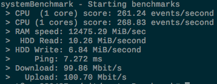

# systemBenchmark

This Makefile script install and use [sysbench](https://github.com/akopytov/sysbench) and [speedtest-cli](https://github.com/sivel/speedtest-cli) to perform benchmarks on Linux and macOS systems.

**Example on an OVH VPS:**


## Install:

### Install on macOS
```
git clone https://github.com/valentinp72/systemBenchmark.git
cd systemBenchmark
make install-macOS
```

### Install on Debian/Ubuntu
```
git clone https://github.com/valentinp72/systemBenchmark.git
cd systemBenchmark
make install-debian
```

## How to use:
```
make benchmarks
```

## Credits:

- [Speedtest-cli](https://github.com/sivel/speedtest-cli) by [Matt Martz
](https://github.com/sivel)
- [Sysbench](https://github.com/akopytov/sysbench) by [Alexey Kopytov](https://github.com/akopytov)